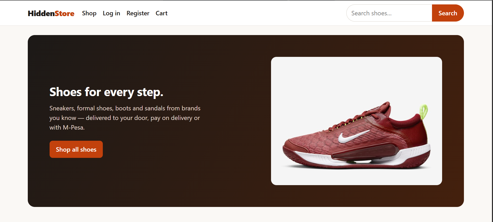
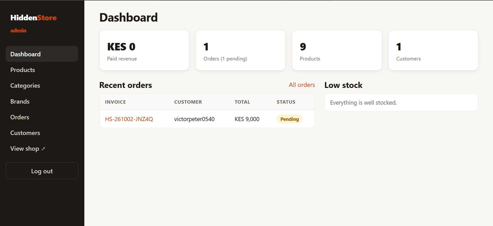
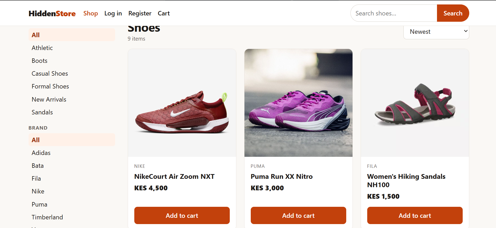
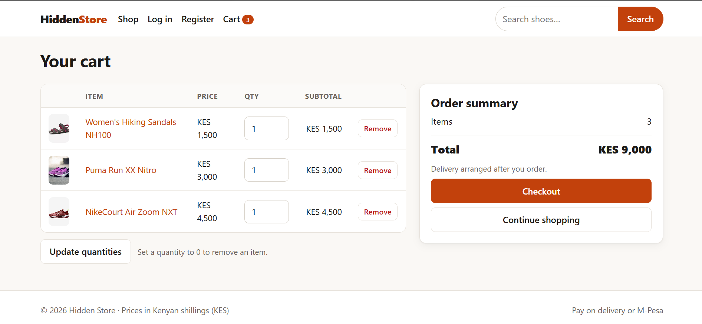

# Hidden Store

**A secure, full-stack e-commerce application built for the Kenyan market.**

Hidden Store is an e-commerce platform where customers can browse products, manage a shopping cart, place orders using **Pay on Delivery or M-Pesa**, and manage their accounts. Administrators can manage products, inventory, customers, orders, and payment status through a dedicated admin panel.

The project is a ground-up **Node.js/Express rebuild of an earlier PHP/MySQL implementation**, with a focus on security, data integrity, automated testing, and maintainable backend architecture.

---

## 🔧 Tech Stack

| Layer          | Technology                  |
| -------------- | --------------------------- |
| Runtime        | Node.js 22.13+              |
| Backend        | Express 4                   |
| Frontend       | EJS, HTML, CSS              |
| Database       | SQLite                      |
| Authentication | Express Sessions, bcrypt    |
| File Uploads   | Multer                      |
| Testing        | End-to-end HTTP tests       |
| Architecture   | Server-rendered application |

---

## 🚀 Features

### Customer

* Product search, filtering, sorting, and pagination
* Product details, image galleries, stock status, and related products
* Session-based shopping cart
* Stock-aware cart quantities
* Customer registration and authentication
* Profile management and password changes
* Checkout with delivery details
* Pay on Delivery and M-Pesa payment options
* Manual M-Pesa confirmation-code submission
* Order history and order details
* Order cancellation while pending
* Account deletion

### Administration

* Dashboard with revenue, order, customer, and inventory metrics
* Product creation, editing, deletion, and stock management
* Product image uploads
* Category and brand management
* Order filtering and status management
* Payment-status management
* Customer management
* Low-stock alerts

---

## 🔐 Security & Engineering

The application was rebuilt to address several security and correctness issues identified in the original PHP implementation.

Key improvements include:

* Parameterized SQL queries to prevent SQL injection
* Automatic HTML escaping to reduce XSS risk
* CSRF protection for state-changing requests
* Session-based authentication and authorization
* Session ID rotation during authentication
* Login rate limiting
* Restricted and validated image uploads
* Server-side price and order calculations
* Authorization checks for customer orders and administrative actions
* No production credentials or customer data committed to the repository

---

## 📦 Data Integrity

Orders and inventory follow explicit business rules.

### Order pricing

Order totals are calculated on the server using the current product prices.

Each order line stores a **price snapshot**, ensuring historical orders remain accurate even if a product's price later changes or the product is deleted.

### Inventory

Stock is reserved atomically when an order is placed, preventing two shoppers from purchasing the same final item.

When an order is cancelled, its reserved stock is returned.

### Order authorization

Customers can only access their own orders.

Only administrators can mark an order as paid.

### Order lifecycle

```text
pending → processing → shipped → delivered
```

or

```text
pending → cancelled
```

---

## Screenshots

### Landing Page



### Store Interface



### Product View


### Shopping Experience



### Additional View



## 🧪 Testing

The project includes end-to-end tests that boot the real application against an in-memory database and exercise it over HTTP.

Test coverage includes:

* Authentication and registration
* Authorization
* CSRF protection
* Product browsing and search
* SQL injection attempts
* Cart behaviour
* Checkout
* Stock handling
* Order privacy
* Admin access control
* File-upload validation
* Order management
* Login rate limiting

Run the test suite with:

```bash
npm test
```

---

## 🏗️ Architecture

```text
Browser
   │
   ▼
Express Application
   │
   ├── Authentication & Sessions
   ├── Shop Routes
   ├── Cart & Checkout
   ├── Customer Accounts
   ├── Admin Panel
   └── Validation & Security Middleware
           │
           ▼
      SQLite Database
           │
           └── Product Images
```

---

## 📁 Project Structure

```text
server.js                Entry point

src/
  app.js                 Express application, middleware, sessions, routes
  config.js              Application configuration and paths
  db.js                  Database schema, seed data, transaction helpers
  session-store.js       SQLite-backed session store
  middleware.js          Template locals, CSRF, authentication, error handling
  cart.js                Cart loading and pricing
  upload.js              Image upload validation and storage
  util.js                Validation, formatting, and rate limiting

  routes/
    shop                 Product browsing and search
    auth                 Registration and authentication
    cart                 Cart and checkout
    account              Customer accounts and orders
    admin                Administration panel

views/
  EJS templates
  admin/                 Admin panel templates

public/
  CSS and seeded product images

test/
  e2e.test.js            End-to-end test suite

data/
  Runtime database and uploaded images
  Git-ignored
```

---

## ⚡ Quick Start

### Requirements

* Node.js **22.13 or newer**

Node.js 22.13+ is required because the application uses the built-in `node:sqlite` module.

### Installation

```bash
npm install
npm start
```

Then open:

```text
http://localhost:3000
```

On the first start, the application creates:

* `data/store.db`
* Seed catalogue data
* An initial administrator account

### Development Admin Account

The default development credentials are:

```text
Email:    admin@example.com
Password: admin12345
```

**Do not use these credentials in production.**

To configure your own administrator credentials, set them before the first application start:

```bash
ADMIN_EMAIL=you@yourshop.co.ke \
ADMIN_PASSWORD='a-strong-password' \
npm start
```

The administrator account is created only when no administrator currently exists.

Admin panel:

```text
http://localhost:3000/admin
```

---

## ⚙️ Configuration

Configuration is provided through environment variables. See `.env.example`.

| Variable         | Default             | Purpose                                           |
| ---------------- | ------------------- | ------------------------------------------------- |
| `PORT`           | `3000`              | HTTP port                                         |
| `NODE_ENV`       | —                   | Set to `production` when deploying                |
| `SESSION_SECRET` | Random per start    | Signs session cookies; required in production     |
| `ADMIN_EMAIL`    | `admin@example.com` | Initial admin email                               |
| `ADMIN_PASSWORD` | `admin12345`        | Initial admin password; development only          |
| `MPESA_TILL`     | —                   | Till/Paybill number displayed for M-Pesa payments |
| `DB_PATH`        | `./data/store.db`   | SQLite database location                          |
| `UPLOAD_DIR`     | `./data/uploads`    | Product image storage location                    |

In production, always configure a strong `SESSION_SECRET` and secure administrator credentials.

---

## 💳 Payment Flow

Hidden Store currently supports two payment methods:

### Pay on Delivery

Customers place the order and pay when the order is delivered.

### M-Pesa

Customers select M-Pesa during checkout and manually enter their M-Pesa confirmation code.

The administrator verifies the payment and marks the order as paid.

**Automated M-Pesa STK Push is not currently implemented.**

---

## 🚀 Deployment

For production deployment:

1. Set:

```bash
NODE_ENV=production
SESSION_SECRET=<long-random-secret>
ADMIN_EMAIL=<production-admin-email>
ADMIN_PASSWORD=<strong-password>
```

2. Serve the application over **HTTPS**.

3. Use persistent storage for the `data/` directory because it contains:

```text
data/
├── store.db
└── uploads/
```

4. Back up the database and uploaded images.

5. Run the application using a process manager such as:

```text
systemd
PM2
Docker
```

Then start the application with:

```bash
npm start
```

SQLite is suitable for a small shop running on a single server. If the application later requires multi-server deployment or higher concurrency, the database can be migrated to PostgreSQL.

---

## 🔄 Rebuilding the Original PHP Application

Hidden Store was rebuilt from an earlier PHP/MySQL implementation.

The rebuild was not simply a framework migration. The application was redesigned to address security, correctness, and maintainability problems found in the original system.

### Security improvements

| Original implementation                                        | Hidden Store                                              |
| -------------------------------------------------------------- | --------------------------------------------------------- |
| SQL queries constructed through string concatenation           | Parameterized SQL queries                                 |
| Unescaped output                                               | HTML escaping through EJS                                 |
| Cart and user identification based on IP addresses             | Session-based identity                                    |
| Payment and order actions trusted IDs supplied in URLs         | Server-side authorization                                 |
| No CSRF protection                                             | CSRF tokens on state-changing requests                    |
| GET requests performed state-changing operations               | State changes use POST requests                           |
| Unrestricted file uploads                                      | Validated images with size limits and generated filenames |
| No login throttling                                            | Login rate limiting                                       |
| Session ID persisted across authentication                     | Session ID rotated during authentication                  |
| Real credentials and customer data committed to the repository | Credentials generated from environment variables          |

### Correctness improvements

* Cart quantities are now stored and calculated per cart line.
* Orders correctly store every line item.
* Product prices are stored as integers rather than text.
* Product category and brand relationships were repaired.
* Stock tracking was added.
* Order line items were introduced.
* Order status transitions were formalized.
* Server-side order totals were implemented.
* Pagination and sorting were added.
* Input validation was added.
* Responsive and accessibility basics were improved.
* Automated tests were introduced.

### Not carried over

The following functionality from the original project was intentionally removed:

* User profile photo uploads
* Non-functional PayPal button
* Original Word report
* Real credentials and customer information

---

## 📈 What I Learned

This project provided practical experience with:

* Designing backend application architecture
* Relational data modelling
* Authentication and authorization
* Secure session management
* SQL and transactional operations
* Inventory management
* Server-side validation
* CSRF protection
* Secure file uploads
* Automated end-to-end testing
* Application security
* Production-oriented Node.js development
* Documenting and deploying a full-stack application

---

## 🔮 Future Improvements

Planned improvements include:

* **M-Pesa STK Push:** Integrate Safaricom Daraja to automate M-Pesa payment initiation and confirmation.
* **Email/SMS notifications:** Notify customers about order creation and status changes.
* **Delivery fees:** Add location-based or configurable delivery charges.
* **PostgreSQL:** Migrate from SQLite when the application's scale and deployment requirements justify it.
* **Improved observability:** Add structured logging, health checks, and application monitoring.

---

## 📄 Licence

MIT License.
